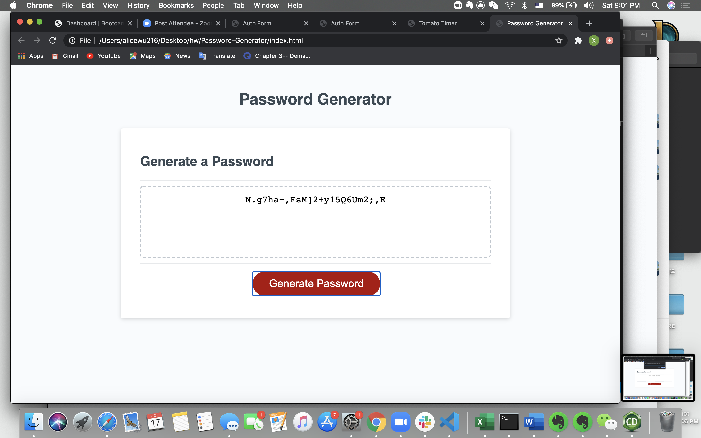

# Password-Generator
HW3 Xiaoxuan Alice Wu Password Generator

repositiory link: https://github.com/Alicewu216/Password-Generator
deployed application link: https://alicewu216.github.io/Password-Generator/

In this project, user can use this website to generate a random password by picking desired character types and password length.

* When user open page, and click generate
* user asked to choose character types including: Uppercase letters, lowercase letters, numbers, and special characters. (password would not generate if none of the categories is picked, alert if happens)
-*user aked to enter a password length between 8-128 (password would not generate if wrong length picked, alert if happens)
* a password containing approximately equal amount of characters from each category is randomly generated and printed to the text area
-*when user click generate again, old password is removed and new password can be generated

## screen shot of application shown below:

